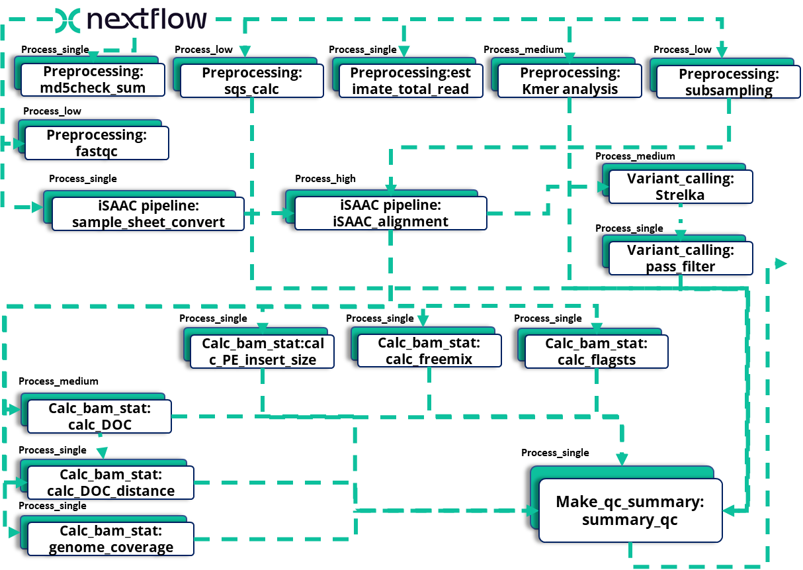

# AESPA: Accurate and Efficient Sub-sampling Pipeline for WGS analysis

## Overview
AESPA (Accurate and Efficient Sub-sampling Pipeline for WGS analysis) is a robust and efficient Nextflow-based pipeline designed for whole genome sequencing (WGS) analysis. The pipeline implements a sophisticated QC workflow with subsampling capabilities to optimize resource usage while maintaining high accuracy.

## Pipeline Flow Chart


The pipeline consists of several key stages:
1. **Preprocessing**: Initial QC including md5 checksum, sequence quality stats, read estimation, k-mer analysis, and subsampling
2. **Alignment**: Using either iSAAC or BWA-MEM2 for read alignment
3. **BAM Statistics**: Comprehensive analysis including insert size, freemix contamination, and flagstat metrics
4. **QC Summary**: Final quality assessment and report generation

## Key Features

### 1. Modular Architecture
- **Preprocessing Module**: Handles initial data preparation and QC
- **Alignment Options**: Supports both iSAAC and BWA-MEM2 aligners
- **Comprehensive QC**: Includes contamination checks, coverage analysis, and variant calling
- **API Integration**: Built-in LIMS integration for automated reporting

### 2. Advanced QC Metrics
- Freemix contamination assessment
- Depth of coverage analysis
- Insert size distribution
- Mapping quality metrics
- Sex determination
- Variant statistics

### 3. Performance Optimization
- Intelligent subsampling based on coverage requirements
- Parallel processing capabilities
- SGE cluster support
- Conda environment management

## Pipeline Structure

```
AESPA/
├── bin/                    # Executable scripts
├── src/                    # reference genome and indexes
├── app/                    # GATK3.7
├── conf/                   # Configuration files
├── modules/                # Individual process modules
├── subworkflow/            # Composite workflow components
├── workflow/               # Main workflow definitions
├── analysis.AESPA.sh       # Wrapper script for running the pipeline
├── main.nf                 # Pipeline entry point
└── nextflow.config         # Nextflow configuration
```

## Workflow Steps

1. **Input Processing**
   - Sample sheet validation
   - Raw data quality assessment
   - Subsampling determination

2. **Alignment**
   - Choice between iSAAC and BWA-MEM2
   - BAM file generation and sorting
   - Duplicate marking

3. **Quality Control**
   - Coverage analysis
   - Contamination assessment
   - Variant calling
   - Sex determination

4. **Reporting**
   - QC metrics compilation
   - LIMS API integration
   - Results delivery

## Configuration Options

```groovy
params {
    // Core Parameters
    max_memory = 210.GB
    max_cpus = 32
    max_time = 240.h

    // QC Thresholds
    freemix_limit = 0.05
    mapping_rate_limit = 88
    deduplicate_rate_limit = 78

    // Pipeline Options
    aligner = 'iSAAC'  // or 'bwa'
    target_x = 5       // Target coverage
    sub_limit = 0.6    // Subsampling threshold
}
```

## Usage Examples

### Basic Run
```bash
nextflow run main.nf -profile sge \
    --outdir results \
    --sample_sheet samples.csv \
    --order_info order_info.txt \
    --run_dir /path/to/data
```

### With Custom Parameters
```bash
nextflow run main.nf \
    -profile sge \
    --aligner 'bwa' \
    --target_x 10 \
    --freemix_limit 0.03
```

## Performance Metrics

- Processing Time: ~1-2 hours per sample (30X coverage)
- Memory Usage: Peak 40GB per sample
- CPU Utilization: Efficiently scales up to 32 cores
- Storage: ~100GB per sample (temporary files)

## Dependencies

- Nextflow ≥ 24.10.4
- Conda/Mamba
- SGE cluster environment
- Reference Genomes (GRCh38)
- Python ≥ 3.8

## Error Handling

The pipeline implements robust error handling:
- Automatic retry for cluster failures
- Comprehensive logging
- Input validation checks
- Resource monitoring

## Output Structure

```
results/
├── ${sample}/
│   ├── ${FCID}.${lane}.bam_stats/
│   │   ├── *.fq_stats.csv           # FastQ statistics
│   │   ├── *.kmer_stats.csv         # K-mer analysis results
│   │   ├── *.freemix.vb2.Ancestry   # Contamination assessment
│   │   ├── *.freemix.vb2.selfSM     # Sample identity check
│   │   ├── *.flagstat               # Alignment statistics
│   │   ├── *.sex                    # Sex determination results
│   │   ├── *.genomecov             # Genome coverage statistics
│   │   ├── *.depthofcov.*          # Depth of coverage analysis
│   │   └── *.QC.summary            # Final QC summary report
│   ├── ${FCID}.${lane}.VCF/
│   │   ├── variants.vcf.gz          # Compressed variant calls
│   │   ├── variants.vcf.gz.tbi      # Variant index file
│   │   ├── genome.vcf.gz            # Full genome VCF
│   │   ├── genome.S1.vcf.gz         # Sample-specific VCF
│   │   └── all_passed_variants.vcf  # Filtered variants
│   ├── BLAST/
│   │   └── blast_top_10.txt         # Top BLAST hits
│   └── API_CALL/
│       └── *_input.json             # LIMS API input data
```

Each sample directory contains:
1. BAM statistics directory with comprehensive QC metrics
2. VCF directory containing variant calls and indexes
3. BLAST analysis results for unmapped reads
4. API call data for LIMS integration

## Future Developments

1. Integration of additional aligners
2. Enhanced variant calling capabilities
3. Machine learning-based QC prediction
4. Cloud platform support, TBD
5. Container support (Docker/Singularity) ,TBD

## License
MIT License

## Contact
For support and questions, please contact: wonjun.lim@psomagen.com
