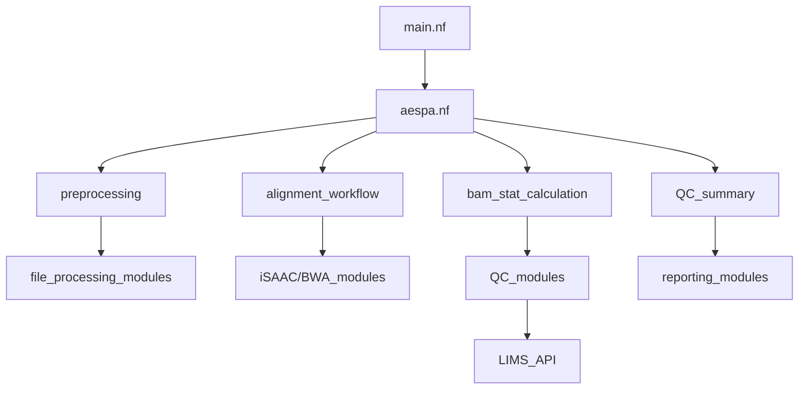

# AESPA Pipeline Modules Documentation

## Main Workflow Structure

### 1. Main Entry Point (main.nf)
The main workflow orchestrates the entire pipeline with the following key components:
- Input validation and preprocessing
- Alignment workflow selection (iSAAC or BWA-MEM2)
- QC processing and reporting
- API integration for LIMS

### 2. Core Workflow (workflow/aespa.nf)
The central workflow module that coordinates:
- Preprocessing of input data
- Alignment execution
- BAM statistics calculation
- QC summary generation

## Module Organization

### API Modules
Located in `modules/API/`:

1. **LIMS_API_POST**
- Purpose: Posts QC results to LIMS system
- Input: QC JSON files
- Output: API response confirmation

2. **wgs_qc**
- Purpose: Generates QC metrics for LIMS
- Input: QC summary files
- Output: Formatted JSON for LIMS integration

### Local Modules
Located in `modules/local/`:

#### Quality Control Modules
1. **calc_DOC**
- Purpose: Calculates depth of coverage
- Input: BAM files
- Output: Coverage statistics

2. **calc_genome_coverage**
- Purpose: Analyzes genome-wide coverage
- Input: BAM files
- Output: Coverage metrics and sex determination

3. **calc_samtools_flagstat**
- Purpose: Generates alignment statistics
- Input: BAM files
- Output: Flagstat metrics

4. **calc_distance**
- Purpose: Calculates coverage distribution
- Input: Coverage data
- Output: Distance metrics

#### Alignment Modules
1. **iSAAC**
- Purpose: Performs iSAAC alignment
- Input: FastQ files
- Output: Aligned BAM files

2. **bwa_pipeline**
- Purpose: Performs BWA-MEM2 alignment
- Input: FastQ files
- Output: Aligned BAM files

#### Data Processing Modules
1. **dedup_rate_predict**
- Purpose: Predicts duplication rates
- Input: FastQ files
- Output: Duplication statistics

2. **estimate_total_reads**
- Purpose: Calculates read metrics
- Input: FastQ files
- Output: Read count estimates

#### File Management Modules
1. **file_search**
- Purpose: Locates input files
- Input: Sample sheet
- Output: Validated file paths

2. **find_raw_data**
- Purpose: Finds raw sequencing data
- Input: Sample metadata
- Output: FastQ file paths

## Subworkflows
Located in `subworkflow/local/`:

### 1. Input Processing
- **input_check**: Validates input files and metadata
- **preprocessing**: Prepares data for alignment

### 2. Alignment Workflows
- **iSAAC_pipeline**: Manages iSAAC alignment process
- **bwa_pipeline**: Manages BWA-MEM2 alignment process

### 3. Quality Control
- **bam_stat_calculation**: Coordinates BAM file analysis
- **QC_CHECK**: Manages QC metric generation
- **RETRY_AESPA_WITHOUT_SUBSAMPLING**: Handles failed QC retries

### 4. Reporting
- **make_deliverables**: Prepares final output files
- **report_prepare**: Generates QC reports

## Module Dependencies



## Resource Requirements

Each module has specific resource requirements defined in the process block:
- Memory allocation
- CPU usage
- Time limits
- Error handling strategies

Example:
```nextflow
process calc_DOC {
    label "process_low"
    memory = { check_max( 25.GB * task.attempt, 'memory' ) }
    cpus = 30
    time = { check_max( 4.h * task.attempt, 'time' ) }
}
```

## Error Handling

Modules implement error handling through:
- Automatic retries for transient failures
- Resource scaling on retry attempts
- Comprehensive error logging
- Validation checks at critical points

## Module Configuration

Module-specific settings are managed through:
- conda environment files in `conf/`
- process-specific configurations in `nextflow.config`
- resource allocation in `base.config`
